<h1 align="center">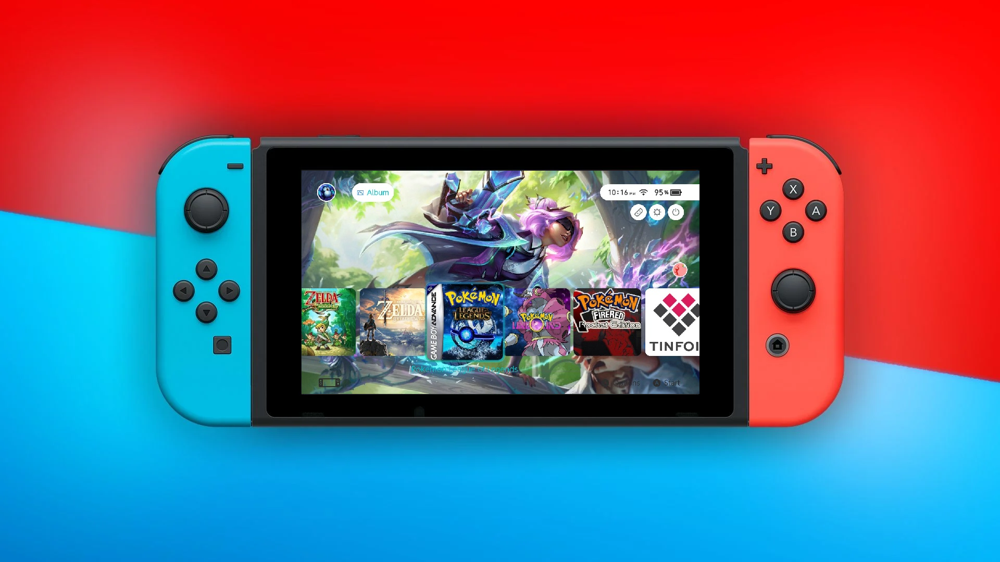 SwitchHack </h1>
<h3 align="center"> All-in-One Guide to Hacking your Nintendo Switch </h3>  
</br> 
	
<p align="center"> 
  
</p>

[](http://hits.dwyl.com/reverentOne/SwitchHack)

<!---<p align="center"> 
  
</p>--->

<!-- TABLE OF CONTENTS -->
<h2 id="table-of-contents"> :book: Table of Contents</h2>

<details open="open">
  <summary>Table of Contents</summary>
<ol >
<li>
  <a href="#intro"> ➤ :camping: Before you Begin</a>
     <ul>
       <li><a href="#why-did-i-make-this-guide"> ➤ :thinking: Why did I make this guide?</a></li>
       <li><a href="#what-you-will-need"> ➤ :hammer_and_wrench: What you will need</a></li>
       <li><a href="#what-can-you-do"> ➤ :electron: What you can do with a hacked switch?</a></li>
       <li><a href="#is-hacking-illegal"> ➤ :detective: Is hacking your switch illegal?</a></li>
       <li><a href="#how-much"> ➤ :moneybag: How much will it cost? How long will it take?</a></li>
     </ul>
<li>
  <a href="#begin"> ➤ :checkered_flag: Lets Begin!
     <ul>
	<li><a href="#setup"> ➤ :floppy_disk: Step 1: Setup SD Card</a></li>
	<li><a href="#enter_rcm"> ➤ :syringe: Step 2: Enter RCM and Inject Payload</a></li>
	<li><a href="#safety"> ➤ :closed_lock_with_key: Step 3: Safety Precautions</a></li>
	<li><a href="#applications"> ➤ :computer: Step 4: Installing Useful Applications</a></li>
     </ul>
<li>
  <a href="#afterwards"> ➤ :crossed_flags: After Installation!
     <ul>
	<li><a href="#accessing"> ➤ :heavy_check_mark: Accessing your installed apps</a></li>
	<li><a href="#overview"> ➤ :world_map: Overview of apps</a></li>
	<li><a href="#games"> ➤ :video_game: Installing games on your Switch</a></li>
	<li><a href="#emulation"> ➤ :joystick: Multi-Console Retro Game Emulation</a></li>
	<li><a href="#cheats"> ➤ :pirate_flag: Game Cheats and Mods</a></li>
	<li><a href="#themes"> ➤ :art: Custom Themes</a></li>
     </ul>
<li><a href="#troubleshooting"> ➤ :monocle_face: Troubleshooting</a></li>
<li><a href="#resources"> ➤ :toolbox: Useful Resources</a></li>
</ol>
</details>


<h1 id="intro" align="center">:camping: Before You Begin! </h1>
<p>

<!-- Why did I make this guide -->
<h2 id="why-did-i-make-this-guide"> :thinking: Why Did I Make This Guide</h2>

<p align="justify"> 
There are many homebrew guides out there. Some are better than others, but all were either made in 2018-2019 and are not well maintained, or they are not easy to follow. None are all-in-one. This guide has its limitations, but if followed it will walk you through every step in the process of setting up a hacked switch. I wrote this guide for a friend of mine who decided they wanted to buy and hack a switch. I got 2 new SD cards and went through this whole process step-by-step 3 times to make sure I'm explaining everything correctly. It is not finished, but I plan to continue updating and expanding it.
</p>


<!-- What You Will Need -->
<h2 id="what-you-will-need"> :hammer_and_wrench: What You Will Need</h2>

* Unpatched Switch
 	- You can find out if your Switch is patched or not by checking the serial number <a href="https://ismyswitchpatched.com/">here</a>
	- <details><summary>Alternatively, for compatable devices see this chart ➤</summary>
		<table>
		<thead>
		<tr>
		<th align="left">Serial Numbers</th>
		<th align="left"><span>Unpatched</span></th>
		<th align="left"><span>Potentially patched</span></th>
		<th align="left"><span>Patched</span></th>
		</tr>
		</thead>
		<tbody>
		<tr>
		<td align="left">XAW1</td>
		<td align="left">XAW10000000000 to XAW10074000000</td>
		<td align="left">XAW10074000000 to XAW10120000000</td>
		<td align="left">XAW10120000000 and up</td>
		</tr>
		<tr>
		<td align="left">XAW4</td>
		<td align="left">XAW40000000000 to XAW40011000000</td>
		<td align="left">XAW40011000000 to XAW40012000000</td>
		<td align="left">XAW40012000000 and up</td>
		</tr>
		<tr>
		<td align="left">XAW7</td>
		<td align="left">XAW70000000000 to XAW70017800000</td>
		<td align="left">XAW70017800000 to XAW70030000000</td>
		<td align="left">XAW70030000000 and up</td>
		</tr>
		<tr>
		<td align="left">XAJ1</td>
		<td align="left">XAJ10000000000 to XAJ10020000000</td>
		<td align="left">XAJ10020000000 to XAJ10030000000</td>
		<td align="left">XAJ10030000000 and up</td>
		</tr>
		<tr>
		<td align="left">XAJ4</td>
		<td align="left">XAJ40000000000 to XAJ40046000000</td>
		<td align="left">XAJ40046000000 to XAJ40060000000</td>
		<td align="left">XAJ40060000000 and up</td>
		</tr>
		<tr>
		<td align="left">XAJ7</td>
		<td align="left">XAJ70000000000 to XAJ70040000000</td>
		<td align="left">XAJ70040000000 to XAJ70050000000</td>
		<td align="left">XAJ70050000000 and up</td>
		</tr>
		<tr>
		<td align="left">XKW1</td>
		<td align="left"><strong>N/A</strong></td>
		<td align="left"><strong>N/A</strong></td>
		<td align="left">XKW10000000000 and up</td>
		</tr>
		<tr>
		<td align="left">XKJ1</td>
		<td align="left"><strong>N/A</strong></td>
		<td align="left"><strong>N/A</strong></td>
		<td align="left">XKJ10000000000 and up</td>
		</tr>
		<tr>
		<td align="left">XJW1</td>
		<td align="left"><strong>N/A</strong></td>
		<td align="left"><strong>N/A</strong></td>
		<td align="left">XJW01000000000 and up</td>
		</tr>
		<tr>
		<td align="left">XWW1</td>
		<td align="left"><strong>N/A</strong></td>
		<td align="left"><strong>N/A</strong></td>
		<td align="left">XWW01000000000 and up</td>
		</tr>
		</tbody>
		</table>
		- If your switch is <b>"Potentially patched"</b> this means there is a high likelyhood that your Switch is patched, but the only way to know for sure is to endter RCM and test it. During <a href="#enter_rcm">Step 2</a> you will not be able to send the payload if it is patched.
		</details>
	- <details><summary>What are my options if my Switch is patched? ➤</summary>
		<br>
		- The scope of this guide only covers unpatched Switches, as the only way to hack a Patched/Lite/OLED is to install a Mod Chip. To learn more about this see <a href="https://wololo.net/2022/02/17/how-to-hack-your-nintendo-switch-2022-edition-hwfly-and-sx-clones-rcm-oled-unpatched-vs-patched-trying-to-clear-it-up-for-you/">here</a>. Mod chips cost ~$130 and can ony be purched through chinese distributors. This is because Nintendo has <a href="https://www.justice.gov/usao-wdwa/pr/public-voice-and-principal-salesperson-notorious-videogame-piracy-group-sentenced-3">cracked down hard</a> on Mod Chip production. Currently the only reliable place to buy a mod chip is <a href="https://www.aliexpress.com/wholesale?catId=0&initiative_id=SB_20220317124818&SearchText=HWFLY">Aliexpress</a>
		<p align="left"><a href="https://www.aliexpress.com/wholesale?catId=0&initiative_id=SB_20220317124818&SearchText=HWFLY">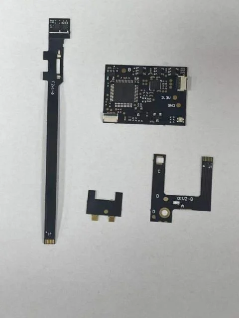</a></p>
	</details>
* Micro SD card (256GB or 512GB Recommended, 64GB Minimum)
  - Keep in mind that games are on average 5GB, but the largest ones are over 15GB
  - Quality is important as this will help with boot and load times
* RCM jig (highly recommended) <a href="https://www.amazon.com/s?k=rcm+jig&crid=2WTYTM5F11KRR&sprefix=rcm+jig%2Caps%2C145&ref=nb_sb_noss_1">Find on Amazon</a>
* A device to send a payload
  - PC recommended, but android phones or jailbroken IOS devises also work
* Some kind of USB cable to connect your Switch to your PC (or other payload sender of choice)


<!-- What you can do with a hacked switch? -->
<h2 id="what-can-you-do"> :electron: What you can do with a hacked switch?</h2>

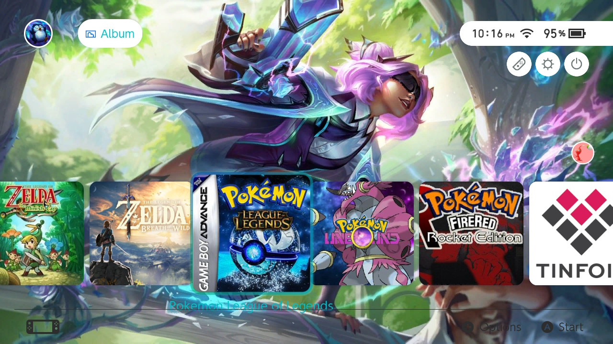

<br>

*	Easily edit, backup and manage game save files
*	Customize your menu pages including home, lockscreen, settings, etc. 
*	Emulate older Console games
*	Download games from a cartridge to your switch
*	Use custom mods and cheats 
*	Connect PS4, Xbox, or other controllers through Bluetooth
*	Play pirated games (Not recommended for legal reasons)
*	Much much more…


<!-- Is hacking your switch illegal? -->
<h2 id="is-hacking-illegal"> :detective: Is hacking your switch illegal?</h2>

*	The short answer is No
*	Hacking your switch is against Nintendo terms of service and puts your device at risk of getting banned. That is all.
*	Pirating games is illegal but…
*	Nobody has EVER been arrested or charged for downloading pirated games. Distributing games is punishable, but again nobody as far as I know has EVER been arrested or charged for pirating games. The reason being that prosecuting <a href="https://en.m.wikipedia.org/wiki/Criminal_copyright_law_in_the_United_States#Legal_definition">criminal copyright infringement</a> requires that the infringer acted "for the purpose of commercial advantage or private financial gain."


<!-- How much will it cost? How long will it take? -->
<h2 id="how-much"> :moneybag: How much will it cost? How long will it take?</h2>

*	~$250-350 USD
*	I bought my switch from an online local marketplace for $230, 256GB SD card for $28 on Amazon, and RCM jig for $7 on Amazon.
*	Using this guide, it should take about 1-2 hours depending on your download speed


<h1 align="center" id="begin"> :checkered_flag: Lets Begin! </h1>
<p>
  
<!-- Step 1e: Setup SD Card -->
<h2 id="setup"> :floppy_disk: Step 1: Setup SD Card</h2>
<p> 
	
1. <details><summary>:camera: Format SD card to Fat32. I used <a href="http://ridgecrop.co.uk/index.htm?guiformat.htm">this tool</a> <a href=""></a></summary>
	
	</details>
2. Download payload sending application to desktop or other easily accessible location
   1. For Windows, you can use <a href="https://github.com/eliboa/TegraRcmGUI/releases">TegraRcmGUI</a> 
   2. For Mac and Linux, you can use <a href="https://github.com/nh-server/fusee-interfacee-tk/releases">fusee-interface-tk</a> 
   3.	For Android, you can use <a href="https://github.com/MenosGrante/Rekado/releases">Rekado</a> 
   4.	For ios, you can use <a href="https://github.com/mologie/nxboot/releases">NXBoot</a>
   5.	For all other payload options see <a href="https://wiki.gbatemp.net/wiki/List_of_Switch_payloads">here</a>
3. Download Software
   1.	Open <a href="https://www.sdsetup.com/console?switch">sdsetup</a>
   2.	Select Recommended Defaults
   3.	Under tesla overlays check **EdiZon Overlay** and **Status Monitor Overlay**
   4.	Under Utilities check **Checkpoint** and **NxThemes Installer**
   5.	Download your ZIP then Extract the files
   6.	Open the SD folder and transfer all the files inside to the root (a.k.a the main/home directory) of your SD card
   7.	Open the Payloads folder and copy `Lockpick_RCM.bin` to your SD card inside the payloads folder which is located inside the bootloader folder
4. <details><summary>:camera: Download latest updates (Extract each and transfer to root of SD card. Click yes when asked to merge and override existing files)</summary>
	
	</details> <p>
		
	1. <a href="https://github.com/Atmosphere-NX/Atmosphere/releases">Atmosphere</a>
   	2. <a href="https://github.com/CTCaer/hekate/releases">Hekate</a>, just the bootloader folder (save the bin file for the next step)
   	3. <a href="https://github.com/ITotalJustice/patches/releases">Sigpatches</a>


<!-- Enter RCM and Inject Payload -->
<h2 id="enter_rcm"> :syringe: Step 2: Enter RCM and Inject Payload</h2>
<p>

1. Insert SD Card into switch
2. Turn off your Switch
	- Hold down the power button on your Switch for 3 seconds and choose power options then Turn Off
3. Take off the right joycon and completely insert the RCM jig 
	- There are many other methods but this one is highly highly recommended. I used an LED light with bent wires before I got the jig which worked but was very annoying.
	- For a list of alternate methods see <a href="https://gbatemp.net/threads/the-ultimate-list-of-mods-to-enter-rcm.502145/">here</a>)
4. Hold down the <b>Volume Up</b> button and press the <b>Power</b> button
	- If the screen stays black that means you are in, YAH! If the switch logo appears, something went wrong, and you need to try again
5. Now you can take out the RCM jig and connect your Switch to your PC
	- For other devices follow the instruction in the README.md file on their individual GitHub pages)
6. Time to open up TegraRcmGUI on your PC
7. Open the settings tab and select Install drivers (First time only)
8. <details><summary>:camera: If your Switch is in RCM mode and connected correctly the red image should turn green and say RCM OK</summary>
	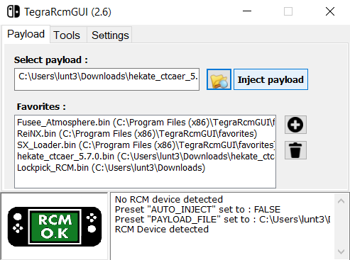
	</details>
9. Select the hetake bin file from when you updated hetake and click Inject Payload
10. Your switch should turn on. You can now disconnect it from your PC
11. Enter the date and time then click Done then OK (First time only)


<!-- Safety Precautions -->
<h2 id="safety"> :closed_lock_with_key: Step 3: Safety Precautions</h2>
<p>
	
These steps will prevent your switch from getting permanently bricked or banned
	
<h4 class="atx" id="partitioning-your-sd-card-and-creating-an-emummc">Partitioning your SD Card and Creating an emuMMC</h4>
<ul>
<li>This is a crucial step to help prevent your device from getting banned</li>
</ul>
<ol>
<li><p>Now you have entered Hetake and your screen should look like this</p>
</li>
<li><p>Select <strong>tools</strong>, then select <strong>Partition SD Card</strong>, then after a while press <strong>OK</strong></p>
</li>
<li><p>Drag the&nbsp;<strong>emuMMC (RAW)</strong>&nbsp;slider to 29GiB</p>
</li>
<li><p>Select&nbsp;<strong>Next Step</strong>,&nbsp;<strong>Start</strong>&nbsp;and wait for it to finish</p>
</li>
<li><p>Return to the home menu and select&nbsp;<strong>emuMMC</strong></p>
</li>
<li><p>Select&nbsp;<strong>Create emuMMC</strong>, then <strong>SD Partition</strong>, then <strong>Part 1</strong></p>
</li>
<li><p>Wait for it to finish. This will take about 15min depending on your SD cards write speed. You are cloning the switches internal memory to your SD card</p>
</li>
<li><p>After installing press <strong>close</strong>, then <strong>change emuMMC</strong>, then <strong>SD Raw 1</strong>, <strong>ok</strong></p>
</li>
</ol>
<h4 class="atx" id="making-a-nand-backup-and-getting-your-consoleand39s-unique-keys">Making a&nbsp;<strong>NAND backup</strong>&nbsp;and Getting your Console's&nbsp;<strong>Unique Keys</strong></h4>
<ul>
<li>This will allow you to restore the device to a working state in case of emergencies.</li>
</ul>
<ol>
<li><p>In Hetake select <strong>tools</strong> then <strong>backup eMMC</strong></p>
</li>
<li><p>Select&nbsp;<strong>eMMC BOOT0 &amp; BOOT1</strong>&nbsp;and wait a few seconds for that to complete</p>
</li>
<li><p>Select <strong>Close</strong>&nbsp;to continue, then Select&nbsp;<strong>eMMC RAW GPP</strong></p>
</li>
<li><p>Wait for it to finish. This will take about 15min depending on your SD cards write speed.</p>
</li>
<li><p>Select&nbsp;<strong>Home</strong>, then <strong>Payloads</strong>, and choose&nbsp;<strong>Lockpick_RCM.bin</strong></p>
</li>
<li><p>Within Lockpick_RCM Select <strong>Dump from SysNAND</strong> (Lockpick_RCM uses the volume buttons to navigate up and down and the power button to select)</p>
</li>
<li><p>Now your keys have been saved to <strong>/switch/prod.keys</strong> on the SD card. These encryption keys will be useful in the event of restoring your NAND as well as for some features of your hacked Switch.</p>
</li>
<li><p>Press any button to return to the main menu, and select <strong>Power Off</strong></p>
</li>
</ol>
<h4 class="atx" id="moving-your-nand-backup-and-prodkeys-to-your-pc">Moving your NAND backup and prod.keys to your PC</h4>
<ol>
<li><p>Insert your SD card into your PC</p>
</li>
<li><p>Move from the root of your SD the&nbsp;<strong>/backup/</strong>&nbsp;folder containing your NAND backup to a safe place on your PC. Optionally, you can Zip it to save storage space.</p>
</li>
<li><p>Copy&nbsp;<strong>prod.keys</strong>&nbsp;from the&nbsp;<strong>/switch/</strong>&nbsp;folder on your SD to the same location on your PC as your NAND backup.</p>
</li>
</ol>
<h4 class="atx" id="setup-exosphere-and-dns-mitm">Setup Exosphere and DNS MITM</h4>
<ol>
<li><p>Open a new file in notepad or anther text editor and paste this inside:</p></li>
	
```
[exosphere]
debugmode=1
debugmode_user=0
disable_user_exception_handlers=0
enable_user_pmu_access=0
blank_prodinfo_sysmmc=0
blank_prodinfo_emummc=1
allow_writing_to_cal_sysmmc=0
log_port=0
log_baud_rate=115200
log_inverted=0
```
	
<li><p>Save the file as <strong>exosphere.ini</strong> to the root of your SD Card</p>
</li>
<li><p>In the <strong>/Atmostphere/</strong> folder on your SD card create an empty folder called <strong>hosts</strong></p>
</li>
<li><p>Open a new file in notepad or anther text editor and paste this inside:</p></li>

```
# Block Nintendo Servers
127.0.0.1 *nintendo.*
127.0.0.1 *nintendo-europe.com
127.0.0.1 *nintendoswitch.*
95.216.149.205 *conntest.nintendowifi.net
95.216.149.205 *ctest.cdn.nintendo.net
```
<li><p>&nbsp;&nbsp;Save the file as <strong>emummc.txt</strong> to your <strong>/atmosphere/hosts/</strong> folder</p>
</li>
</ol>
	
<u><strong>Note:</strong></u> Older guides recommend 90DNS. DO NOT DO THIS. It is not necessary and will slow down your internet connection. Incognito is also redundant as Exosphere does the same thing
	


<!-- Installing Useful Applications -->
<h2 id="applications"> :computer: Step 4: Installing Useful Applications</h2>
<p>
Your Switch is now hacked and safe to use. In this step you will install many applications that I will explain in detail later. Follow each of the links below and install the files onto your SD card

<ol>
    <li>Transfer these nro files into your switch folder:</li> 
	    <ul>
				<li><a href="https://github.com/mtheall/ftpd/releases">ftpd pro</a> (download <code>ftpd.nro</code> )</li>
				<li><a href="https://github.com/tallbl0nde/NX-Activity-Log/releases">Activity Log</a> (Create a folder called <code>NX-Activity-Log</code> inside the Switch folder and place <code>NX-Activity-Log.nro</code> inside of it)</li>
		</ul>
    <li>Unzip and Transfer these to the root of your SD card:</li>
	    <ul>
		    <li><a href="https://www.retroarch.com/index.php?page=platforms">RetroArch for Switch</a> (RetroArch is a large file and will take longer than the rest so be patient)</li>
		    <li><a href="https://tinfoil.io/Download">Tinfoil nro Self Installer</a></li>
		    <li><a href="https://github.com/averne/Fizeau/releases">Fizeau</a></li>
		    <li><a href="https://github.com/tallbl0nde/TriPlayer/releases">TriPlayer</a></li>
		    <li><a href="https://github.com/ndeadly/MissionControl/releases">MissionControl</a></li>
		</ul>
</ol>
<details><summary>:camera: This is what your root and switch folders should look like</summary>
	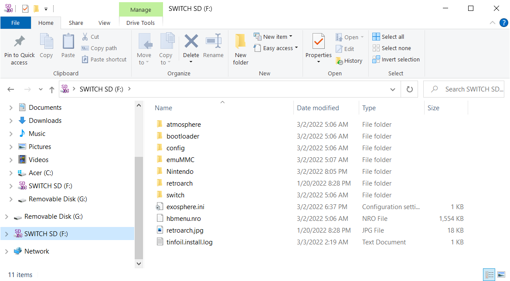
	&nbsp;&nbsp;&nbsp;
	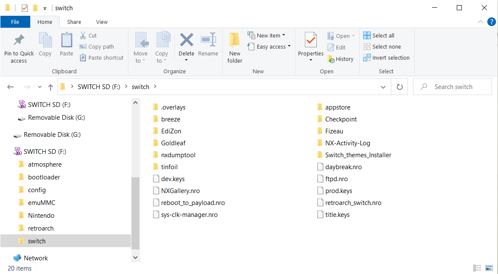
	</details>
	


<h1 align="center" id="afterwards"> :crossed_flags: After Installation! </h1>
<p>
	  
<!-- Accessing your Installed apps -->
<h2 id="accessing"> :heavy_check_mark: Accessing your Installed apps</h2>
<p>
	
1. Follow <a href="#enter_rcm">step 2<a/> completely. Now click **launch**, then **Fusee**. This should start your Homebrew Switch. ***Each time you Turn off your switch or take out the SD card you will have to repeat this process.*** If you keep your switch powered on (which is quite easy to do) then this process won’t have to be followed.
2. Accessing the homebrew menu: There are 2 ways to open the homebrew menu.
   1. First, you can launch it through the Album (Hold R when selecting if you actually want to access the Album not the hbmenu)
   2. Second, you can launch it by selecting any game while holding R
      - Some hb apps don’t work if you access the menu through the Album, but until you have a game you need to use the Album
3. Opening Tesla Menu
4. Mission Control
   - with MissionControl, you can use other consoles’ controllers on your Switch through Bluetooth. This is a background process 
   - For a list of compatible controllers look <a href="https://github.com/ndeadly/MissionControl">here</a>. I use the DualShock 4 PlayStation controller
   - To pair a controller, go to the Switch Home screen, then Controllers, then Change Grip/Order. While on this screen, place your controller in pairing mode and wait for it to connect to the switch. That is all!
	
	

	
<!-- Overview of apps -->
<h2 id="overview"> :world_map: Overview of apps</h2>
<p>

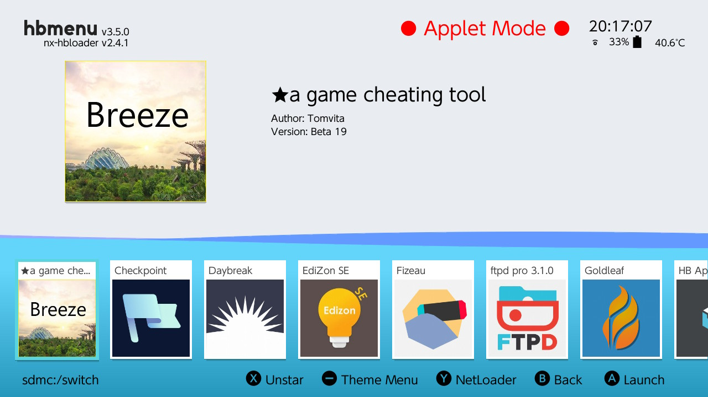
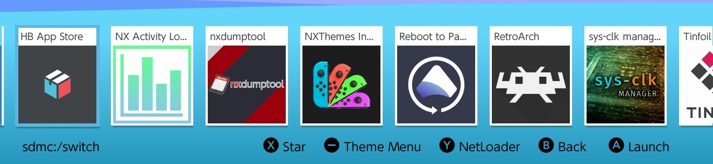
<p>
	
Note: Skip to Tinfoil to start downloading games

1. **Breeze and Edizon SE**
2. **Checkpoint**
   - Checkpoint is a fast simple save manager. With this tool you can backup or edit save files. For a while this app wasn’t compatible with the latest firmware. If that happens again check out JKSB which does essentially the exact same thing
3. **Daybreak and Reboot to Payload**
4. **Fizeau** (<a href="https://github.com/averne/Fizeau/blob/master/README.md">Documentation</a>)
   - Fizeau allows you to adjust the color of your screen with corrections including gamma, luminance, and color range. I usually use this to filter out some blue light when playing at night. You can also use this to try and make games look more vibrant. I usually access this through the Tesla Menu. 
5. **Ftpd pro** (<a href="https://github.com/mtheall/ftpd/blob/master/README.md">Documentation</a>)
   - This is one of my very favorite apps. This allows you to download onto your switch wirelessly through Wi-Fi.
   - On your PC file browser, enter the ip address with the ftp:// prefix. e.g. ftp://xxx.xxx.x.x:5000
   - The Switch SD files should now appear on your PC. This is extremely useful for small files, but not recommended for files larger than 100MB as the transfer speed is much slower than direct to SD card
6. **Goldleaf** (<a href="https://github.com/XorTroll/Goldleaf/blob/master/README.md">Documentation</a>)
   - This is a multipurpose app that acts as a filesystem browser, NRO installer, web browser, and more
   - If for whatever reason all the Tinfoil app stores are down you can use this app to install NRO game files
7. **HB App Store** (<a href="https://github.com/fortheusers/hb-appstore/blob/master/README.md">Documentation</a>)
   - This is a store for homebrew apps. Feel free to browse this and download any apps that seem interesting. Personally, I don’t like using this, but others may really appreciate it. There are many outdated or useless apps on the store so be careful. Most of the documentation for the apps are going to be on GitHub so I recommend you check that out before installing
   - Start by checking out nxmp if you want a video player, ppsspp if you want to emulate psp games, amuiibo for virtual amiibos, sysDVR if you want to stream switch games to your PC
8. **NX Activity Log** (<a href="https://github.com/tallbl0nde/NX-Activity-Log/blob/master/README.md">Documentation</a>)
   - Because you can no longer connect to Nintendo servers you wouldn’t be able to see your activity and game play times without this app.
   - I recommend you replace your User Page with this app. To do that go to settings, scroll down to the bottom, and select Replace User Page to Enable it
9. **nxdumptool** (<a href="https://github.com/DarkMatterCore/nxdumptool/blob/main/README.md">Documentation</a>)
10. **NXThemes Installer** (<a href="https://github.com/exelix11/SwitchThemeInjector/blob/master/readme.md">Documentation</a>)
11. **Sys-clk manager** (<a href="https://github.com/retronx-team/sys-clk/blob/develop/README.md">Documentation</a>)
    - Sys-clk is a system-wide underclock and overclock sysmodule that allows you to overclock the Switch. It includes automatic underclocking and overclocking depending on if you are docked and what games you are playing
12. **Retroarch**
    - RetroArch is a frontend for many different emulators. This is the Multipurpose tool you will use to emulate most consoles. See <a href="#retroarch">Retroarch</a>
13. **Tinfoil Installer**
    - Used to install Tinfoil for the first time. See <a href="#games">Installing games on your Switch</a>
14. **TriPlayer**
    - See <a href="https://github.com/tallbl0nde/TriPlayer/wiki">TriPlayer wiki</a>

	


<!-- Installing games on your Switch -->
<h2 id="games"> :video_game: Installing games on your Switch</h2>

<p>I will go over the 3 main ways to install and play games on your Switch. Only method 1 is recommended. Methods 2 and 3 are for informational purposes only as <b>I do not promote or encourage unlawful activities including piracy</b></p>
<ul>
<li><p>Method 1: Buying games through Nintendo and playing online</p>
<ul>
<li>Regional eshops</li>
</ul>
</li>
<li><p>Method 2: Tinfoil shops</p>
<ul>
<li><p>Luffshop</p>
</li>
<li><p>Titz Pro shop</p>
</li>
<li><p>NUT</p>
</li>
</ul>
</li>
<li><p>Method 3: PC Download and Transfer</p>
<ul>
<li><p>Nekodrive</p>
</li>
<li><p>jitz share</p>
</li>
<li><p>ROM Websites and Torrents</p>
</li>
<li><p>Goldleaf Installer</p>
</li>
</ul>
</li>
</ul>
<h3 class="atx" id="Method One: buying-games-through-nintendo-and-playing-online"><strong>Method 1: Buying games through Nintendo and playing online</strong></h3>
<p>The only way to play online games is to buy the game from Nintendo's eshop or the cartridge from a distributor. In order to play online you will need to boot using sysNAND. To do this: inject hetake like normal, select launch, then sysNAND. WARRNING: Make sure you do not break any of Nintendo's terms of service while in sysNAND or you will get banned! Banned means you will no longer be able to access any Nintendo features on your device including the eshop and online play. If you cheat in online games, your Switch will be banned as well as your Nintendo account will be banned.</p>
<ul>
<li><strong>Regional eshops</strong>
 There is a completely legitimate way to get many games super cheap! This is, by buying games from a different region's eshop. Some games are significantly cheaper. For example, as of this writing in the USA eshop the game Overlanders costs $24.99 while that same game cost about $0.92 in Poland. You can find the region with the cheapest prices for each game <a href="https://eShop-Prices.com">here</a>. If the eshop does not accept your method of payment, then you may have to buy an eshop card for the region and use that.</li>
</ul>
<h3 id="#tinfoils"><strong>Method 2: Tinfoil Shops</strong></h3>
<p>Tinfoil is by far the easiest fastest and best way to access pirated games!</p>
<ol>
<li><p>Boot into your switch using fusee and make sure you are connected to the internet</p>
</li>
<li><p>On your switch open the hbmenu and select Tinfoil installer</p>
</li>
<li><p>After installation Tinfoil should show up as an app on the Switch home</p>
</li>
<li><p>To add shops open Tinfoil if not already open, select File Browser, and press (-)</p>
</li>
<li><p>Now you fill out the information for the shop you want (see Luffshop and Titz Pro)</p>
</li>
<li><p><details><summary>:camera: A new tab in Tinfoil should appear called New Games</summary>
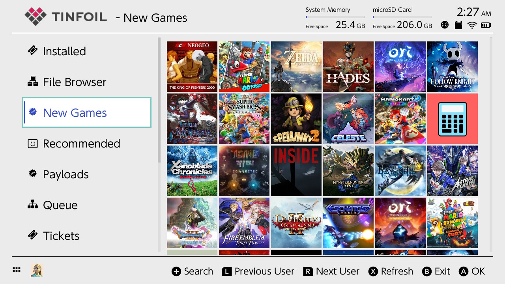
</details></p>
</li>
<li><p>Great! Now you can search for any games or DLCs that your heart desires</p>
</li>
</ol>
<h5 class="atx" id="luffshop">Luffshop</h5>
<p>Luffshop is not actually a shop but a redirect to many other shops. Sometimes shops go down, but with Luffshop you will have a better shot at having access to games.</p>
<details><summary>:camera: Fill out:</summary>
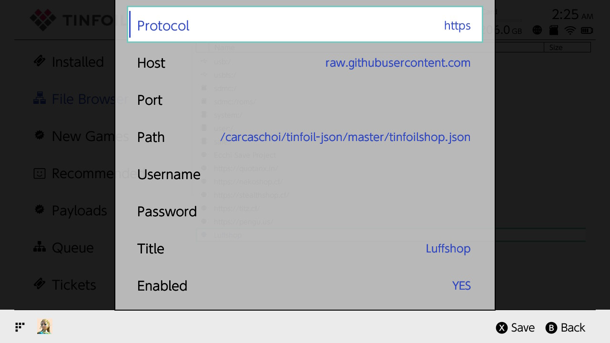
</details>

<ul>
<li><p>Protocol: https</p>
</li>
<li><p>Host: raw.githubusercontent.com</p>
</li>
<li><p>Path: carcaschoi/tinfoil-json/master/tinfoilshop.json</p>
</li>
<li><p>Titles: Luffshop</p>
</li>
</ul>
<p>The details, if needed, to install Luffshop can be found <a href="https://github.com/carcaschoi/tinfoil-json">here</a></p>
<h5 class="atx" id="titz-pro-shop"><strong>Titz Pro shop</strong></h5>
<p>One of the shops that Luffshop redirected you to is titz (turtle in the shop). There is also a premium shop called Titz Pro. The only way to access this shop is through the turtle in the shop discord server <a href="https://discord.com/channels/829394042025672704/874130275343401000">here</a></p>
<p>Follow the instructions under the channel #info-check-here-first. You will need to buy an eshop code and donate it. There are links to where to buy codes under #support-nintendo. $5 cards work as well as 500 Yen cards</p>
<p>If you donate a 500 yen card you can get access to the shop in as quickly as 10 minutes. You can also donate codes in USD, EUR, CAD, GBP &amp; AUD but it may take a day or two to get access. In the discord there are instructions on how to buy a 500 yen card for about $4 USD.</p>
<p><details><summary><em>Descord help for noobs</em></summary>
<ul>Discord can be extremely confusing and looks archaic if you are not used to it. When you open the turtle in the shop discord there should be a bunch of channels on the left side that all have # next to them. Find the one that says #bot-commands and open it. Now at the bottom there should be a way for you to send a message. Type /donate. You will then get a personal message from a bot named Donations. The bot will ask you questions about your donation. Once your donation is confirmed you can go back to the turtle in the shell server. This time open the #tits-pro-access channel and type ?request. You should now get a personal message from a bot named no spies who will give you the shop key. For more help read <a href="https://support.discord.com/hc/en-us/articles/360045138571-Beginner-s-Guide-to-Discord">this</a></ul>
</details></p>
<ul>
<li><p><em>Why would I get Titz Pro?</em></p>
<ol>
<li><p>You are supporting the community as all donations go into expanding all the stores</p>
</li>
<li><p>Because tits pro is private it gets less traffic and is less likely to shutdown compared to other shops</p>
</li>
<li><p><details><summary>:camera: Gain access to Retroarch titles through Tinfoil. Nothing new, but this is a time saver. Just download the cores from Retroarch and the games will show up</summary>
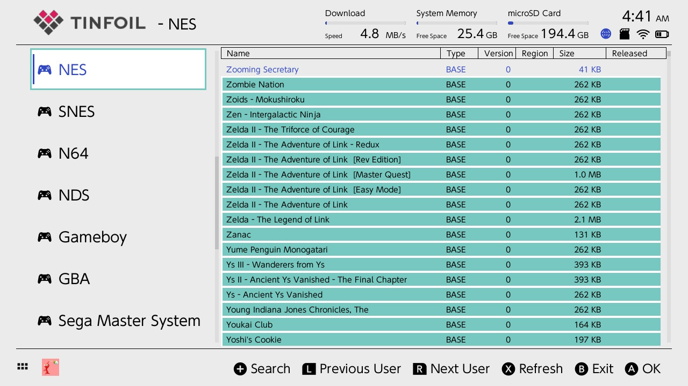
</details></p>
</li>
<li><p>You get early access to many titles. (Games get leaked, especially ones with physical releases. The most common reason is an employee of a store takes a copy home early from the stock that arrived. That is why leaks are usually 1-7 days before release.)</p>
</li>
<li><p>Gain Contributor roles in partner shop Discords. This includes: Pengu, Quota, Neko, Stealth and jits. This perk includes gaining access to Nekoshop's Google drive stash.</p>
</li>
</ol>
</li>
</ul>
<p>*To install games via USB on Windows use <strong>NUT</strong>:</p>
<ol>
<li><p>Download the nut release and the driver installer for nut <a href="https://github.com/blawar/nut/releases">here</a></p>
</li>
<li><p>Run nut on your pc and launch tinfoil on your switch and connect them via a usb cable</p>
</li>
<li><p>Run the driver installer so that nut reports the device as connected in the top right</p>
</li>
<li><p>To install games either scan the folder they are located in with nut to make them appear in the usb section of file browser, or using usbfs in file browser and browse to the folder they are in</p>
</li>
</ol>
<h3 class="atx" id="methods-for-pc-download">Method 3: PC Download and Transfer</h3>
<h5 class="atx" id="nekodrive">Nekodrive</h5>
<p>Nekodrive is a shared Google Drive stash. When you donate to tits pro you will gain access to nekodrive.</p>
<ol>
<li><p>After gaining access, join the nekodrive <a href="https://discord.com/channels/835841234467553312">discord server</a></p>
</li>
<li><p>There should be a channel under the Contributor tab called #kool-kids-klub
In that channel select Pinned Messages and follow the link that says nekoshop Drive sign-up</p>
</li>
<li><p>Fill this form out. (To get your Discord ID go to Discord settings, then Advanced, then turn on Developer mode. Now, in Discord you need to select yourself. To find yourself select Show member list, now scroll and find your name, right click, select copy ID)</p>
</li>
<li><p>Once the form is filled out you may have to wait a bit to gain access</p>
</li>
</ol>
<h5 class="atx" id="jitz-share">jitz share</h5>
<p>With jitz share, instead of gaining access to a shared google drive, you will have to save games directly to your drive. The only advantage I see over nekodrive is that you
don't need to donate before gaining access. All the instructions are clearly
laid out <a href="https://games.jits.cc/">here</a></p>
<ul>
<li>Note: For&nbsp;jitz share you may want to make a new google account. This is quick and easy, and will free up Drive space. The maximum free space is still 15GB so most games will download, but there are a few that are too large.</li>
</ul>
<h5 class="atx" id="rom-websites-and-torrents">ROM Websites and Torrents</h5>
<p>There are many websites that offer pirated games. Unfortunately, every one of them are completely filled with ads, hidden downloads, and viruses. This method is the most time consuming and dangerous. An <strong>ad blocker is required</strong>, but even then it only does so much. It's also recommended you <strong>scan for viruses</strong></p>
<p>Torrenting is another method of obtaining games, but this is <b>highly risky without a paid VPN</b> to hide your IP address. Without a VPN many people receive copyright infringement warnings from their internet service provider. You are unlikely to go to court over this, but after a few warnings the ISP may shutdown your internet access. The best client is <a href="https://www.qbittorrent.org/download.php">qbittorrent</a></p>
	

	
<!-- Multi-Console Retro Game Emulation -->
<h2 id="emulation"> :joystick: Multi-Console Retro Game Emulation</h2>

<p align="center"> 
  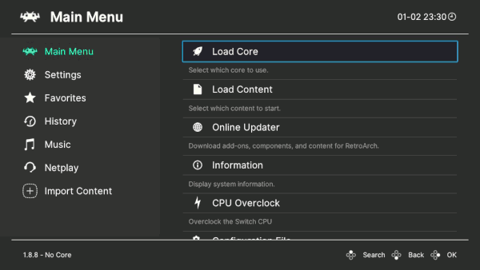&nbsp;&nbsp;&nbsp;&nbsp;&nbsp;&nbsp;&nbsp;&nbsp;&nbsp;&nbsp;&nbsp;&nbsp;&nbsp;&nbsp;&nbsp;&nbsp;&nbsp;&nbsp;&nbsp;&nbsp;&nbsp;&nbsp;&nbsp;&nbsp;&nbsp;&nbsp;&nbsp;&nbsp;&nbsp;&nbsp;&nbsp;&nbsp;&nbsp;&nbsp;&nbsp;&nbsp;&nbsp;&nbsp;&nbsp;&nbsp;&nbsp;&nbsp;&nbsp;&nbsp;&nbsp;&nbsp;&nbsp;&nbsp;&nbsp;&nbsp;&nbsp;&nbsp;&nbsp;
</p>

The Switch is great at emulating some consoles and not so great at emulating others. Here is breakdown:

- Great Emulation: N64, GBA, and all previous Nintendo systems, many 4th generation or earlier consoles
  
  - Retroarch will be used for almost all emulation
    
  - Use Nintendo Switch Online for N64 games. This can be found using Tinfoil shops. This may require you to Link a Fake Nintendo Online Account which can be done through Options in Tinfoil
    
- OK Emulation with Overclocking: DS, 3DS, PSP, PS1, Dreamcast
  
  - The Switch is not the optimal way to emulate these systems. I recommend an Android phone or PC, but many games do work OK
    
  - Depending on your game you may be able to play with minimal lag
    
  - Use the Citra core for 3DS games (Access after donating \$1 to <a href="https://www.patreon.com/citraemu">this</a> patreon)
    
  - Use PPSSPP for PSP games
    
  - Overclock to 1785 MHz for best performance
    
- Hit-or-miss Emulation with Android OS: Game Cube, Wii
  
  - Technically, if you get the Android OS on Switch, you can get more emulators like Dolphin to run Wii and GameCube games. I do not recommend this as there are much better ways to Emulate these systems.
    
  

<h3 id="#retroarch">Retroarch</h3>

RetroArch is a frontend for many different emulators. This is the Multipurpose tool you will use to emulate most consoles. There is also built in Overclocking.

Playing games is very simple. These are the steps:

1. Find games you want to play and download the ROMs. I recommend [this](https://www.romsgames.net/) website (Ad blocker recommended)
2. Create a ROMS folder in the root of your switch. Now create a folder inside this ROMS folder for each console you want to emulate. For example, name one ‘NES’ and another ‘GBA’, etc.
3. Transfer your downloaded games into their game folders you just created on the Switch
4. On your switch open the hbmenu and select Retroarch
5. Under Main Menu select Load Core then Download a Core. A list will appear, and you can download the core for each console you plan to emulate
6. Under Main Menu select Load Content then Start Directory then locate the ROMS folder
7. Select which game you wish to play and start playing!

([Retroarch Documentation](https://www.retroarch.com/))

<h3>NSP Forwarder</h3>

Now you will quickly come to realize that it takes some time to open your games. I just tested and it took me 17 clicks to open a game starting from the switches home. I will show you a way to have games on your Switch home so you can start playing in as little as one click.

1. Follow <a href="https://gbatemp.net/threads/gui-for-nsp-forwarder-tool-for-12.588018/">this</a> link and download the zip file. It is a GUI for an NSP Forwarder (an alternative Forwarder can be found <a href="https://github.com/dezem/SAK/releases">here</a>)
  
2. Unzip the file and transfer it to a safe place on your PC.
  
3. Open it and run the menu executable and follow the next steps for each game
  
4. <details><summary>:camera: Fill out each box in the GUI before clicking Create Forwarder</summary>
  	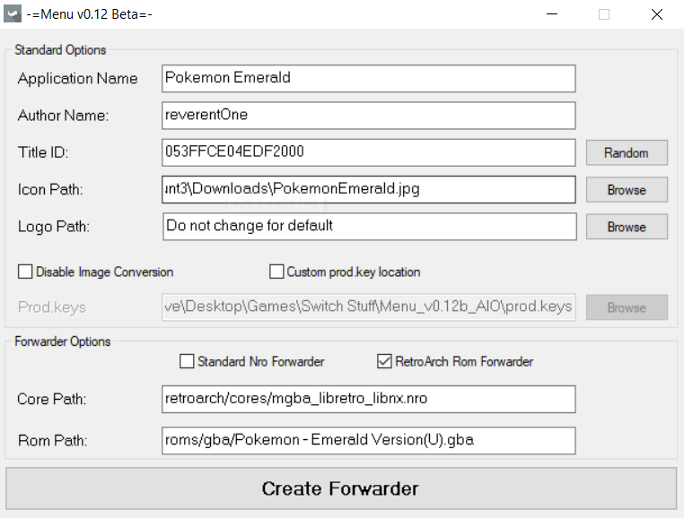
    	</details>
  
  	- Application Name: Name of the game you want displayed
  	- Author Name: You or whoever/whatever you want here
  	- Title ID: Hit the random key to generate an ID
  	- Icon Path: Where you have the icon you want used when you select the game
  	- Logo Path: Small logo you see when you boot the game. I keep this blank
  	- (Your images must be 256x256 for icons, 160x40 for logos)
  	- Custom prod.keys location: I like keeping a copy of my prod.keys in the root folder of the app. You should have a copy of your prod.keys in your Switch folder as well as a backup on your PC.
  	- Forwarder Options: Check the Retroarch Rom Forwarder
  	- Core Path: This is the path on your SD card from the root to the core you want to use for the rom.
  	- Rom Path: This is the location of your rom you want to use with the core you selected in the previous step.
5. The Forwarder should have created nsp files in the NSP folder on the root of the app
  
6. Now create a folder on the root of your SD card called NSP Files or whatever
  
7. Transfer the files in the NSP folder on the root of the app to the NSP Files folder on the root of your SD card
  
8. On your switch open the hbmenu and select Goldleaf then Explore content then SD card then NSP Files
  
9. Install each nsp file and they should now show up on your Switch’s Home!
	  
	  


<!-- Game Mods and Cheats -->
<h2 id="cheats"> :pirate_flag: Game Mods and Cheats</h2>
<p>


<!-- Custom Themes -->
<h2 id="themes"> :art: Custom Themes</h2>
<p>
	
Creating your own theme pack is one of the most fun and creative aspects of hacking your Switch! If you want the quick and easy way, there there are many premade packs available that you can use. If you are feeling abitious, then you can go all the way and even customize your game icons.
	
<p align="center">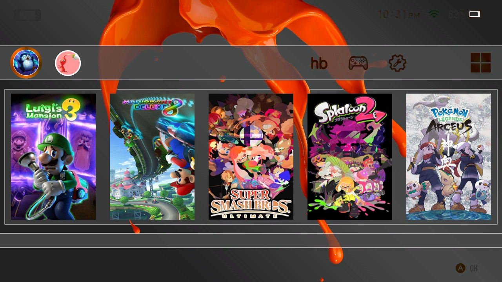</p>

### Install a Custom Theme

1. Create a <code>themes</code> folder on the root of your SD card
  
2. Copy the <code>.nxtheme</code> files to the <code>themes</code> folder on your SD card
  
3. Launch the Homebrew Menu and launch <code>NXThemes Installer</code>
  
4. Select and Install each of your themes one by one
  
5. Reboot your Switch
  

### Finding premade theme packs

- The best place to find theme packs is [Themezer](https://themezer.net/packs)
  
- Other places to find packs include [reddit](https://www.reddit.com/r/NXThemes/) and [gbatemp](https://gbatemp.net/download/categories/themes.1671/)
  
- Cool selection of Custom Vertical themes [here](https://github.com/sodasoba1/nx-vertical-themes) (you probably want to use custom vertical game icons in conjuction with these themes)
  

### Make a Custom Theme Pack

1. Download the [Switch Theme Injector](https://github.com/exelix11/SwitchThemeInjector/releases/latest "switch theme injector") application (the <code>Releasex.x.x.zip</code> file)
  
2. Open up the <code>SwitchThemes.exe</code> app and navigate to NXTheme Builder
  
3. Select a Home menu part, a 1280x720p image and a Layout patch. Click on Build NXTheme
  
4. Fill out the Author name and Theme name in the window that pops up.
  
5. Repeat step 3 and 4 for every Home Menu part of the Switch you want to modify.
  

### Install a Custom Font

1. Copy the <code>.ttf</code> file to the <code>themes</code> folder on your SD card
  
2. Launch the Homebrew Menu and launch <code>NXThemes Installer</code>
  
3. Select and Install your font
  
4. Reboot your Switch
  

### Install a Custom Users Icon/Avatar

1. Find or Create (using an image editor such as paint) a JPEG with 256x256 dementions
  
2. Copy the <code>.jpeg</code> file to your SD card. (I recommend you create an <code>icons</code> folder inside your <code>themes</code> folder to keep everything organized)
  
3. Launch the Homebrew Menu and launch <code>Godleaf</code>
  
4. Locate your image and select Replace user icon
  

### Install Custom Game Icons

- This is done most often in conjunction with a Vertical or horizontal theme pack
  

1. download sys-tweak <a href="https://gbatemp.net/threads/custom-game-icons-tutorial-and-sharing-hub.574675/post-9738297">here</a> (or <a href="https://github.com/p-sam/switch-sys-tweak/actions">here</a>) using <a href="https://gbatemp.net/threads/custom-game-icons-tutorial-and-sharing-hub.574675/">these</a> instructions
  
2. You can confirm sys-tweak is set by checking your sysmodules through the Tesla menu
  
3. Download nx-titles-list-dumper.nro and copy to your /switch folder
  
4. Launch the Homebrew Menu and launch nx-titles-list-dumper
  
5. press [A] to dump your installed title IDs to the root of your SD card in a CSV file
  
6. Copy the titles.csv file from the root of your SD to your PC
  
7. Download <a href="https://github.com/hotshotz79/NX-Game-Icon-Customizer/releases">NX-Game-Icon-Customizer</a> and open NX-Game Icon Customizer.exe
  
8. Select Scan and wait for it to say Ready at the bottom of the window
  
9. Under Title IDs select show Icons for installed games only, now select your Style and find your games alphabetically
  
10. To automatically install all available icons select Auto GIC, select your style, then Add All to Output
  
11. To create your own icons select Add New, fill out the options, then select Add
  
12. After you have added all your prefered icons to the output you can Transfer it to your Switch using FTPD
<br />
<br />
<p align="center">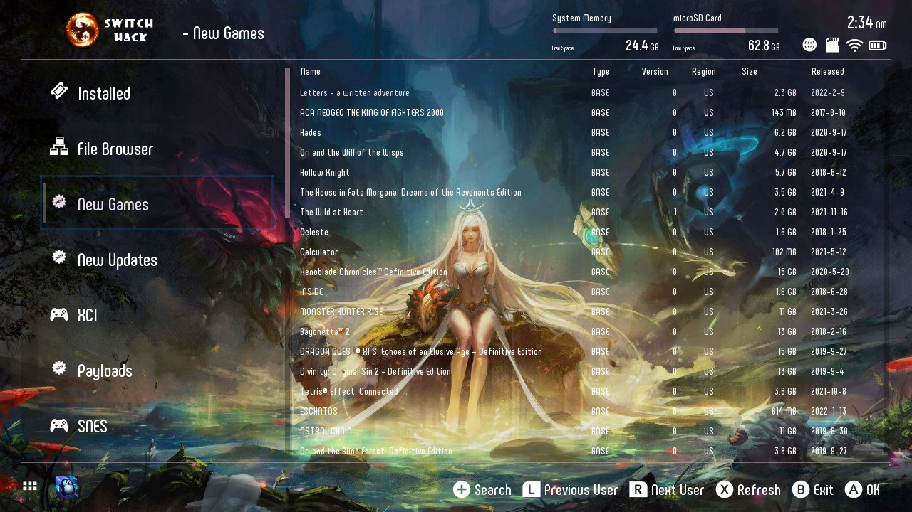</p>	

### Install a Custom Tinfoil theme

1. You can use my custom theme found <a href="Themes/Tinfoil/SwitchHack/SwitchHack.zip">here</a> or find a theme <a href="https://gbatemp.net/threads/blawar-tinfoil-themes.533692/">here</a> or make your own theme.
  
2. Copy the theme's folder to /switch/tinfoil/themes
  
3. Open Tinfoil, Scroll down to Options, and select your theme
  
	
### Make a Custom tinfoil theme

1. Create a new folder located in the /switch/tinfoil/themes folder on your SD card
  
2. Find or Create (using an image editor such as paint, gimp, or photoshop) a PNG or JPEG that has 1280x720 dementions and copy it to your new folder
  
3. Find or Create (using an image editor such as paint, gimp, or photoshop) a PNG or JPEG that has 165x52 dementions and copy it to your new folder
  
4. Find an MP3 file, reduce it to 128kbps using <a href="https://www.mp3smaller.com/">this</a> tool, and copy it to your new folder
  
5. Open <a href="Themes/Tinfoil/SwitchHack/settings.json">settings.json</a> in a text or code editor such as <a href="https://code.visualstudio.com/download">Visual Studio Code</a>
  
6. Edit each of the colors to your prefered hex value with the help of <a href="https://www.color-hex.com/">this</a> tool
  
7. Edit the file locations to match your file and folder names under "logo", "image", and "url"
  
8. Save the file as <code>settings.json</code> and copy it to your new folder
	
### Custom NX-Activity-Log Theme

If you replaced your user page with NX-Activity-Log then you will have to make a separate theme for it. Simply:

1. Find and save a 1280x720 PNG as <code>background.png</code>
  
2. Copy it to your SD card at /config/NX-Activity-Log/background.png
  
3. Open your user page, select Settings, and change Theme to Custom
  
4. Now select Customize Theme, Customize by selecting your RGBA values, and apply with [x]
	


<!-- Troubleshooting -->
<h2 id="troubleshooting"> :monocle_face: Troubleshooting</h2>
<p>
	
<h3>Do you have errors running hetake or Atmosphere or another App?</h3>
<ul>
<li>The fix that works in 90% of cases is to delete the file and reinstall while following the guide exactly. For example, say Retroarch is giving you an error message. The best and easiest solution is to delete the Retroarch folder from the root of SD and then reinstall it.</li>
</ul>
<h3 class="atx" id="a-homebrew-app-isnt-working">A Homebrew App isn’t working?</h3>
<ul>
<li>Make sure you opened the hb menu using the game + R method not the album method.</li>
</ul>
<h3 class="atx" id="tinfoil-isnt-working">Tinfoil isn’t working?</h3>
<ul>
<li>Make sure your sigpatches are up to date</li>
</ul>
<h3 class="atx" id="having-issues-updating-my-switch">Having issues updating my switch?</h3>
<ul>
<li>Make sure you have themes turned off</li>
</ul>
<h3 class="atx" id="i-ran-out-of-storage-when-i-shouldnt-have">I ran out of storage when I shouldn’t have?</h3>
<ul>
<li>You might have a fake SD card. Use this&nbsp;free <a href="https://3ds.hacks.guide/h2testw-(windows).html">H2Testw</a> tool to test if your SD card is fake. Use <a href="https://crystalmark.info/en/">CrystalDiskMark</a> to test read / write speeds.</li>
</ul>
<h3 class="atx" id="tinfoil-shops-arent-working">Tinfoil shops aren’t working?</h3>
<ul>
<li><p>If this is your first time using the shop, make sure you are connected to the internet and you booted using fusee</p>
</li>
<li><p>If you have gotten shops to work before but now they are not working, know that shops go down all the time. This is normal. Check their discords for status updates. Often tits pro is the only shop working, but even it sometimes goes down.</p>
</li>
</ul>
<h3 class="atx" id="my-battery-life-is-really-bad">My battery life is really bad?</h3>
<ul>
<li><p>Turn down your brightness, and go into airplane mode to decrease your power usage</p>
</li>
<li><p>Replace your battery for about $19</p>
</li>
</ul>
<h3 class="atx" id="games-arent-working">Games aren’t working?</h3>
<ul>
<li>Make sure you have the latest firmware and version of atmosphere</li>
<li>Try turning off TryPlayer or other music players as they crash games that already use 2 audio sessions</li>
</ul>
<h3 class="atx" id="how-do-i-un-hack-my-switch">How do I un-hack my switch?</h3>
<ul>
<li>Simply don't boot into recovery mode. Evrything Homebrew is on your emuNAND on your SD card.</li>
</ul>
	


<!-- Useful Resources -->
<h2 id="resources"> :toolbox: Useful Resources</h2>
<p>
	
Switch hacking communities:
* GBATEMP: https://gbatemp.net/forums/nintendo-switch.283/
* Reddit: https://www.reddit.com/r/SwitchPirates/
* Discord: https://discord.gg/C29hYvh
<p>
	
Contact me through <a href="https://www.reddit.com/user/reverent-girl">Reddit</a> or <a href="https://discordapp.com/users/698387044509941821">Discord</a>
